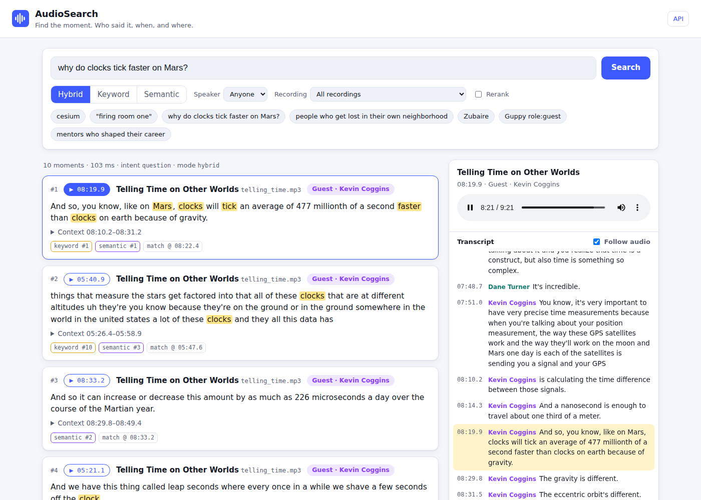

# AudioSearch: find the moment in two-speaker audio

**Hybrid search over conversations that returns the exact moment.** Each result gives the file, the
second where the sentence starts, the speaker who said it (label, host/guest role, name) and the
highlighted words. A player jumps straight to that second.

Search by **exact words** (BM25), by **meaning** (embeddings) or by **sound**. The sounds-like channel
recovers names that the speech recognizer or the user misspelled. Everything runs locally on
PostgreSQL + pgvector.



<!-- RESULTS:START -->
### Results on the held-out test split (52 queries, never used for tuning)

| System | Recall@1 | Recall@5 | Recall@10 | MRR | p95 latency |
|---|---:|---:|---:|---:|---:|
| BM25 only | 0.458 | 0.721 | 0.773 | 0.695 | 22 ms |
| Dense only (bge-base, pgvector HNSW) | 0.620 | 0.887 | 0.929 | 0.889 | 66 ms |
| Hybrid, plain RRF | 0.578 | 0.855 | 0.907 | 0.837 | — |
| **AudioSearch** (coverage-weighted RRF + sounds-like + moments) | **0.660** | **0.915** | **0.966** | **0.908** | **66 ms** |

* A relevant moment is the **top result for 87 % of queries** and in the top 5 for 96 %.
* Exact terms and quoted phrases: Recall@5 **1.00**. Paraphrases: Recall@10 **1.00** (BM25 alone: 0.28).
* Misspelled and ASR-mangled names: BM25 0.52 → **0.95** with sounds-like expansion.
* Upstream, measured against NASA's human transcripts: **WER 4.3 %**, **99.9 %** word-level speaker
  attribution, host/guest role **6/6**.
* 4 vCPU, no GPU. Latency percentiles come from `scripts/benchmark_latency.py`. The full report,
  ablations and significance tests are in [docs/EVALUATION.md](docs/EVALUATION.md).
<!-- RESULTS:END -->

## What sets it apart

| | Differentiator | Evidence |
|---|---|---|
| N1 | **Sounds-like retrieval.** Phonetic (Metaphone) and orthographic expansion against the *spoken* vocabulary. It recovers ASR errors ("apheresis" → *aphoresis*) and typos ("Zubaire") without touching ordinary words. | misspelled Recall@5 0.52 → 0.95 (BM25) |
| N2 | **IDF-coverage-weighted RRF.** Lexical votes count only as much as they cover the query's informative terms, so BM25 matches on filler words can no longer bury the right semantic hit. | paraphrase Recall@5 in hybrid 0.67 → 0.89 |
| N3 | **Moment localisation.** Passage hits snap to the single best utterance: exact start, one speaker, word-level match time. Temporal NMS removes duplicates. | +11 pts Recall@5 vs passage start (p = 0.03) |
| N4 | **Role-aware search.** Host/guest inferred from conversational behaviour (6/6 correct). Filter with `role:guest`. | [DATASET](docs/DATASET.md) |
| N5 | **Punctuation-aware diarization.** ECAPA + spectral clustering + Viterbi that allows speaker changes cheaply only at sentence or pause boundaries. Fully local, no gated models. | 99.9 % word-level speaker accuracy |
| N6 | **Chunking-invariant evaluation.** Relevance labelled as audio-time intervals, with a held-out test split, CIs, significance tests and stage-level WER and diarization metrics. | [EVALUATION](docs/EVALUATION.md) |

## Quickstart

### Docker: one command

```bash
docker compose up --build        # Postgres+pgvector → migrate + index the committed transcripts → API
open http://localhost:8000       # web UI · API docs at /api/docs · metrics at /metrics
```

### Local development

```bash
make setup                        # .venv with CPU torch + all extras (uv)
make db                           # or use any Postgres 16 with pgvector, pg_trgm, fuzzystrmatch
make index                        # index committed transcripts (no ASR needed)
make serve                        # http://localhost:8000
make test && make eval            # 70 unit/integration tests + Recall@K quality gate
```

To re-run the whole audio pipeline from the MP3s (local ASR + diarization, about 3 min per file on 4 CPU
cores), run `make build`. To rebuild the dataset from NASA's servers, run `python scripts/build_dataset.py`.

## Using it

**CLI**

```bash
audiosearch search "why do clocks tick faster on Mars?" --explain
audiosearch search '"firing room one"'                   # strict phrase
audiosearch search "Guppy role:guest"                    # only what the guest said
audiosearch search "Zubaire" --mode lexical              # sounds-like: zubaire → zubair, abizubair
```

**HTTP**

```bash
curl 'localhost:8000/api/search?q=vestibular%20system&k=5&role=guest'
```

```json
{"intent": "keyword", "expansions": [], "hits": [{
  "file_id": "wayfinding", "timestamp": "07:13.4", "start": 433.45, "end": 445.11, "match_time": 435.57,
  "speaker": "SPEAKER_01", "speaker_role": "guest", "speaker_name": "Giuseppe Iaria",
  "text": "And so the information that our vestibular system, some organs that are in our inner ears, they process while we move, while we accelerate, while we turn left, we turn right.",
  "highlights": [[32, 42], [43, 49]], "channels": {"lexical": 1, "dense": 1}, "audio_url": "/media/wayfinding"}]}
```

**Pipeline and operations:** `audiosearch ingest | index | build | stats | eval run | eval stages | db migrate | serve`.

## How it works

```
audio ─► faster-whisper (large-v3-turbo, word timestamps) ─► ECAPA + spectral k=2 + boundary-aware Viterbi
      ─► utterances / turns / host-guest roles ─► 50-word windows ─► bge-base embeddings + BM25 postings
query ─► BM25 (+ sounds-like expansion) ║ pgvector HNSW ─► IDF-coverage-weighted RRF ─► moment snapping + NMS
```

Design and rationale: [docs/TDD.md](docs/TDD.md). Product requirements: [docs/PRD.md](docs/PRD.md).

## Repository map

```
src/audiosearch/
  pipeline/   asr · diarization · alignment · roles · chunking · ingest (cached, idempotent)
  search/     query · filters · lexical (BM25 SQL) · phonetic · dense · fusion · moments · engine
  eval/       golden set · metrics · runner (ablations) · report · stage metrics (WER, diarization)
  db/         migrations (templated embedding dim, model-mismatch guard)
  api/        FastAPI app + static web UI
  indexing.py incremental BM25 statistics, vocabulary, embeddings
data/         audio, manifest, NASA reference transcripts, pipeline transcripts, golden queries
tests/        unit · integration (Postgres) · HTTP contract · eval (Recall@K gate)
scripts/      dataset builder, label helper, dev-split tuning sweeps, diarization ablation
reports/      generated evaluation reports (Markdown + JSON)
docs/         PRD · TDD · EVALUATION · DATASET · AGENT_COLLABORATION
```

## Documents

| Document | Contents |
|---|---|
| [SUBMISSION.md](SUBMISSION.md) | Hackathon write-up: design, rationale, success criteria, achievement, limitations |
| [docs/PRD.md](docs/PRD.md) | Refined product requirements (changes vs the draft, differentiators, success criteria) |
| [docs/TDD.md](docs/TDD.md) | Technical design: algorithms, schema, operations, scaling plan, decision log |
| [docs/EVALUATION.md](docs/EVALUATION.md) | Methodology, full results, ablations, error analysis |
| [docs/DATASET.md](docs/DATASET.md) | Golden dataset card and labelling protocol |
| [docs/AGENT_COLLABORATION.md](docs/AGENT_COLLABORATION.md) | Coding-agent disclosure: how the agent was directed and verified |

## Data and license

Code: MIT. The audio and reference transcripts are NASA *Houston We Have a Podcast* material, US
Government works generally not subject to US copyright. Their use implies no NASA endorsement. See
[docs/DATASET.md](docs/DATASET.md).
