# TDD — AudioSearch Technical Design

Companion to [PRD.md](PRD.md). Results referenced here are reproduced by `make report`
([EVALUATION.md](EVALUATION.md)). Every design decision in §11 is backed by a measurement on the
**dev** split. Test-split numbers are only reported, never tuned on.

---

## 1. Context and scope

Input: two-speaker conversational recordings (here, 6 × 9.3 min NASA interviews).
Output: a search service that answers keyword, phrase, paraphrase and natural-language queries with
**moments**: file, start time, speaker (label, role, name), highlighted text. Constraints: embeddings
and indexing run locally; PostgreSQL + pgvector is the store; Python throughout.

## 2. Architecture

```mermaid
flowchart LR
  subgraph Ingestion["Ingestion (offline, idempotent, cached)"]
    A[audio file] --> V[ffprobe validate<br/>sha256]
    V --> ASR[faster-whisper<br/>large-v3-turbo int8<br/>word timestamps]
    ASR --> M[merge sub-word tokens<br/>F + -15 → F-15]
    M --> D[ECAPA windows → spectral k=2<br/>→ boundary-aware Viterbi]
    D --> U[utterances + turns]
    U --> R[host/guest roles]
  end
  R --> T[(canonical transcript JSON<br/>data/transcripts/…)]
  T --> IX
  subgraph IX["Indexer (per-file transaction + advisory lock)"]
    C[50-word windows / 25 stride] --> E[bge-base embeddings<br/>passages + utterances]
    C --> P[BM25 postings, df, N, Σdl<br/>incremental]
    C --> W[spoken vocabulary<br/>metaphone / dmetaphone]
  end
  IX --> PG[(PostgreSQL 16<br/>pgvector HNSW · GIN · pg_trgm · fuzzystrmatch)]
  subgraph Query["Query path (p50 48 ms, p95 66 ms on 4 vCPU)"]
    Q[query] --> QP[parse: phrases, role:, file:]
    QP --> L[BM25 in SQL<br/>+ sounds-like expansion]
    QP --> S[query embedding → HNSW]
    L --> F[IDF-coverage-weighted RRF]
    S --> F
    F --> RR[optional cross-encoder]
    RR --> SN[moment snapping<br/>+ temporal NMS]
  end
  PG <--> Query
  SN --> API[FastAPI /api/search<br/>web UI · CLI · /metrics]
```



| Component | Module | Replaceable behind |
|---|---|---|
| Audio I/O | `audio.py` | ffmpeg / ffprobe |
| ASR | `pipeline/asr.py` | `AsrEngine` protocol (`transcribe(audio) -> AsrResult`) |
| Diarization | `pipeline/diarization.py` | `diarize(audio, words, segment_ends)` |
| Alignment, roles, chunking | `pipeline/{alignment,roles,chunking}.py` | pure functions |
| Orchestration + caches | `pipeline/ingest.py` | — |
| Storage | `db/` (migrations), `indexing.py` | PostgreSQL + extensions |
| Retrieval | `search/{query,filters,lexical,phonetic,dense,fusion,moments,engine}.py` | per-channel functions |
| Serving | `api/app.py`, `api/static/*`, `cli.py` | — |
| Evaluation | `eval/{golden,metrics,runner,report,stage_metrics}.py` | — |

## 3. Data model

```
audio_files(file_id PK, title, audio_path, sha256, duration_sec, sample_rate, channels,
            metadata jsonb, transcript_meta jsonb, index_signature, indexed_at)
speakers(file_id FK, label, role, role_confidence, display_name, talk_time, n_words, question_rate)
utterances(id PK, file_id FK, idx, speaker, start_sec, end_sec, text, words jsonb,
           tsv tsvector GENERATED, embedding vector(D))                       -- moment unit
chunks(id PK, file_id FK, idx, start_sec, end_sec, utt_start, utt_end, speakers text[],
       text, embed_text, n_words, tsv tsvector GENERATED, doc_len, embedding vector(D))  -- retrieval unit
chunk_terms(lexeme, chunk_id FK, tf)          PK(lexeme, chunk_id)         -- BM25 postings
term_stats(lexeme PK, df)   corpus_stats(n_docs, sum_doc_len)              -- BM25 statistics
vocabulary(term PK, df, metaphone, dmetaphone, dmetaphone_alt)             -- sounds-like lookup
index_meta(key, value)      schema_migrations(version)                     -- safety + migrations
```

Indexes: HNSW (`vector_cosine_ops`, m=16, ef_construction=64) on chunk and utterance embeddings;
GIN on both `tsv`; the `chunk_terms` PK doubles as the inverted index (lexeme → postings); GIN
trigram plus btree metaphone indexes on `vocabulary`. `D` is rendered from the embedding model at
migration time and recorded in `index_meta`. Start-up **refuses** a model/dimension mismatch
(`SchemaMismatchError`); switching models means indexing into a new schema (blue/green) and
flipping `AUDIOSEARCH_DB_SCHEMA`.

**Two granularities.** *Chunks* (≈50 words ≈ 20 s, 50 % overlap, may span both speakers) are
retrieved for recall. *Utterances* (one sentence, one speaker) are the unit of a result: the
timestamp and speaker a user sees always come from exactly one utterance.

## 4. Ingestion pipeline

### 4.1 Audio
`ffprobe` validates each file (decodable, non-zero duration) and records its metadata. The sha256 of the bytes is
the cache key for every downstream artefact. `ffmpeg` decodes to 16 kHz mono float32.

### 4.2 ASR — faster-whisper `large-v3-turbo` (int8, CPU)

Measured on a 60 s clip on 4 vCPUs (int8, beam 5, word timestamps):

| Model | RTF | Notes |
|---|---:|---|
| base.en | 0.09 | fastest; kept as the *ASR-quality ablation* transcript set |
| small.en | 0.20 | |
| medium.en | 0.42 | slower **and** a weaker encoder than turbo |
| **large-v3-turbo** | **0.24** | large-v3 encoder with a 4-layer decoder: best quality per CPU-second |

On the full excerpts: RTF 0.19–0.21 (≈ 2 min per 9.3-min file). Settings: VAD filter (Silero, 500 ms),
`condition_on_previous_text=False` (prevents repetition loops on long audio), temperature fallback,
language `en`. Whisper emits sub-word "words" for hyphenated tokens (`F`, `-15`). We re-join them
using the spacing preserved in segment text (`merge_continuations`), which is a prerequisite for
exact search on "F-15", "T-38s", "WB-57".

Quality vs NASA's human transcripts: **WER 4.3 %** overall (1.8–8.4 % per file). The reference is
clean verbatim, so this is an upper bound.

### 4.3 Diarization — ECAPA + spectral clustering + boundary-aware Viterbi

pyannote's pipelines require a gated Hugging Face token. The default here is fully open and local:

1. **Windows.** 1.5 s windows with 0.75 s hop over speech regions derived from ASR word times.
2. **Embeddings.** SpeechBrain ECAPA-TDNN (VoxCeleb), 192-d, batched.
3. **Clustering.** Cosine affinity with row-wise pruning (keep the top 30 %, as in Park et al.
   2019), spectral clustering with k = 2 (the corpus contract fixes two speakers), then spherical
   k-means refinement.
4. **Posteriors.** softmax(τ · cos(e, centroid_k)), τ = 10, averaged onto a 0.1 s frame grid, then
   averaged over each word's span.
5. **Smoothing.** Viterbi over *words*, with emission = log posterior and transition cost
   ```
   cost(i-1 → i) = 0                      if same speaker
                 = λ · δ                  if a boundary precedes word i   (λ = 4, δ = 0.15)
                 = λ                      otherwise
   boundary = previous word ends a sentence  OR  ends an ASR segment  OR  pause ≥ 0.6 s
   ```
   Speaker changes are cheap where conversations actually change turns and expensive mid-sentence,
   which removes single-word "flicker".
6. **Labels.** Clusters are relabelled by first appearance (SPEAKER_00, SPEAKER_01). Each word keeps
   its posterior as a confidence.

Measured: **99.9 % word-level speaker attribution** vs NASA transcripts (6 files, 9.1k aligned words).
Smoothing ablation (`reports/diarization_ablation.md`), word diarization error rate:
boundary-aware Viterbi **0.09 %**; raw window vote 0.11 %; uniform-cost Viterbi 0.27 %;
ASR-segment majority vote (WhisperX-style) 2.10 %. Cost: ≈ 70 s per 9.3-min file on 4 vCPU.
We also record an objective difficulty metric per file, the inter-speaker centroid cosine.

### 4.4 Utterances and turns
A new utterance starts at a speaker change, at sentence-final punctuation (abbreviation-aware:
"Dr.", "U.S."), at a pause ≥ 1.5 s, or after 50 words (split at the last comma). Turns are maximal
same-speaker runs.

### 4.5 Role inference
`host_score = 3·question_rate + 1.5·(0.5 − talk_share) + 0.5·[opens conversation]`. The top scorer is
the host; confidence = logistic(4·margin). Display names from the manifest are attached only when
confidence ≥ 0.75. Result: 6/6 hosts correct.

### 4.6 Chunking
Sliding windows of whole utterances: target 50 words, stride 25 words (sentence-aligned), spanning
speakers. Optional *dialogue-context augmentation* (`chunk_context=question`) prepends the other
speaker's latest question, within 240 s, to the **embedded** text only. It is off by default because it
did not help on dev (§11).

### 4.7 Caching and idempotency
`<id>.asr.json` is keyed by (audio sha256, ASR model). `<id>.json` is keyed by (ASR meta, diarization
parameters, normalisation version). The index row is keyed by `index_signature` = hash(transcript
signature, chunking config, embedding model). Models load lazily and only on a cache miss, so
re-running `audiosearch ingest && audiosearch index` over an unchanged corpus is a sub-second no-op
per file.

## 5. Indexing

Per file, in one transaction under `pg_advisory_xact_lock`:
1. If the file exists: decrement `term_stats.df`, `corpus_stats` and `vocabulary.df` by its
   contribution, then delete it (cascades).
2. Insert the file, speakers, utterances (with word timings and embeddings) and chunks.
3. Postings: `INSERT INTO chunk_terms SELECT lexeme, id, len(positions) FROM chunks, unnest(tsv)`, then
   `doc_len`, `df += …`, `N += …`, `Σdl += …`.
4. Vocabulary: `df += …` with `metaphone(term, 12)`, `dmetaphone`, `dmetaphone_alt` computed in SQL.

Embeddings are computed *before* the transaction opens, so locks are held for ~100 ms. Invariant
(integration-tested across insert, replace and delete): incremental statistics equal a full
recomputation.

## 6. Query path

### 6.1 Parsing
`"quoted phrases"` become strict phrase filters (`tsv @@ phraseto_tsquery`) on both channels.
`role:host|guest`, `speaker:SPEAKER_01` and `file:<id>` are filters. The rest is free text. The
parser also classifies intent (keyword / phrase / question / topic); intent currently only drives
how moment snapping weighs lexical evidence.

### 6.2 Lexical channel: BM25 in SQL
Query lexemes come from `to_tsvector('english', q)`, so they match the index exactly (stemmed and
stop-worded). Scoring over the postings table:

```
BM25(d) = Σ_t  w_t · ln(1 + (N − df_t + 0.5)/(df_t + 0.5)) · tf·(k1+1) / (tf + k1·(1 − b + b·dl/avgdl))
k1 = 1.2, b = 0.75, w_t = 1 for query terms, 0.9·confidence for sounds-like expansions
```

We implement BM25 ourselves because Postgres `ts_rank` has no IDF, and BM25 extensions (e.g.
pg_search) are unavailable on most managed Postgres services. BM25 in plain SQL is portable anywhere
pgvector runs.

### 6.3 Sounds-like expansion (N1)
For each content token of the query (≥ 4 letters), the policy is:

| In spoken vocabulary? | Common English word?* | Candidates accepted |
|---|---|---|
| no | no (name, typo) | phonetic or spelling neighbours, score ≥ 0.62 |
| no | yes ("inside") | Metaphone-identical only, score ≥ 0.80 |
| yes, rare (df ≤ 2) | no ("apheresis") | Metaphone-identical variants only (catches "aphoresis") |
| yes | — | none |

\* Whole words in the embedding tokenizer's WordPiece vocabulary (~21k): a zero-cost English lexicon.

Candidates come from one SQL query over `vocabulary`: trigram `%` (GIN), `metaphone(·,12)` equality,
`dmetaphone` equality, and a prefix-substring probe for ASR word merges ("abizubair").

```
ortho = max(trigram, 1 − lev/max_len, 0.70 if longest-common-substring ≥ 85 % of the token)
score = min(1, max(ortho, .55) + .25)   if metaphone equal
      = min(1, ortho + .12)              if double-metaphone equal (and trigram ≥ .25)
      = ortho                            otherwise
```

Expansions are shown to the user and counted in the metrics.

### 6.4 Dense channel
Query embedding (bge-base-en-v1.5, with the BGE query instruction) → HNSW `ORDER BY embedding <=> q`
with `hnsw.ef_search = max(100, n)`, set per transaction. With pgvector ≥ 0.8 we enable
`hnsw.iterative_scan = relaxed_order` for filtered queries (role, file, phrase) and re-sort the small
result set exactly.

### 6.5 Fusion: IDF-coverage-weighted RRF (N2)

```
score(d) = Σ_c  w_c · m_c(d) / (k + rank_c(d)),     k = 10,  top-50 per channel
m_dense(d)   = 1
m_lexical(d) = coverage(d) = Σ_{u ∈ U} idf_u · credit_u(d) / Σ_{u ∈ U} idf_u
U = distinct query lexemes; idf_u = BM25 IDF, or the maximum IDF for lexemes absent from the corpus
credit_u(d) = 1 if d contains u;  = expansion weight if d contains a sounds-like stand-in for u;  else 0
```

Plain RRF discards scores. With a small corpus it lets a passage that BM25 ranked highly for "people"
and "world" beat the right semantic match, because appearing in both lists is rewarded. Coverage
restores a *calibrated* piece of score information: it lies in [0, 1] and is comparable across
queries, unlike raw BM25. On dev with the final configuration it raised hybrid Recall@5 from 0.80 to 0.92
at k = 60 (paraphrase: 0.40 to 1.00), and from 0.88 to 0.93 at k = 10. On the held-out test split it
gained +4.1 R@5 and +5.2 MRR over plain RRF, and fixed plain RRF's paraphrase loss (0.67 → 0.89). Surface-form intent weights add nothing on top of it, so
they are off by default (kept for ablation). A convex combination of min-max-normalised scores is
available (`fusion=cc`).

### 6.6 Optional reranking
A cross-encoder (`ms-marco-MiniLM-L-6-v2`) scores the top 30 fused passages. Its rank is fused with
the first-stage rank by RRF. It is off by default (+~250 ms on CPU); the API loads it lazily on
`rerank=true`.

### 6.7 Moment snapping and temporal NMS (N3)
For the top max(3k, k+20) passages, one SQL query returns each constituent utterance's cosine
similarity to the query, the query lexemes it contains, and `ts_headline` markup. For each passage:

```
lex(u) = Σ_{lexeme ∈ u} idf·w  (normalised by the passage max);  sem(u) = min-max of cosine within the passage
score(u) = α·lex(u) + (1 − α)·sem(u),  α = 0.8 for keyword/phrase intent, 0.5 otherwise, 0 if no lexical match
utterances with < 4 words get half their semantic score (back-channels look similar to everything)
```

The best utterance gives the result's start and end time, speaker and highlights. `match_time` is the
start of the first highlighted word, mapped through the utterance's word timings. Temporal NMS
drops a moment if a better one from the same file is within 10 s or their passages overlap by more
than 50 %. Role and speaker filters apply at the utterance level: a passage that contains the guest
still snaps only to a *guest* utterance.

### 6.8 Latency (quiet 4-vCPU VM, 81 queries × 3 rounds, `reports/latency.md`)
Per-stage timings are returned with every response and exported as Prometheus histograms.

| Mode | p50 | p95 | p99 | mean per stage |
|---|---:|---:|---:|---|
| hybrid (default) | 48 ms | 66 ms | 74 ms | embed 32 · BM25 + sounds-like 5 · ANN 3 · fusion 1 · moments 8 · hydrate 1 |
| lexical only | 11 ms | 22 ms | 28 ms | |
| hybrid + reranker | 272 ms | 331 ms | 376 ms | rerank 199 |

The query embedding dominates. All Postgres work is ~15 ms at this scale.

## 7. Interfaces

* **CLI** (`audiosearch`): `db migrate|reset`, `ingest`, `index`, `build`, `search`, `stats`, `eval run|stages`, `serve`.
* **HTTP** (FastAPI, OpenAPI at `/api/docs`): `GET /api/search`, `/api/files`,
  `/api/files/{id}/transcript`, `/media/{id}` (HTTP Range), `/healthz`, `/readyz`, `/metrics`.
* **Web UI**: vanilla JS, no build step, strict CSP. Mode, role and file filters. ▶ jumps to the moment.
  The transcript follows playback, with speaker colours. Results can be deep-linked
  (`/?q=…&mode=…`).

## 8. Evaluation design (summary; details in EVALUATION.md)

* Golden set: 81 queries, 7 categories, 154 time-interval moments, dev 29 / test 52, frozen before
  tuning.
* Hit: same file and the moment's span overlaps the labelled interval ±5 s. Each labelled moment is
  credited once.
* Metrics: Recall@{1,3,5,10}, Success@K, Precision@K, MRR@10, nDCG@10 (graded), median start offset,
  latency p50/p95. 95 % bootstrap CIs over queries; paired permutation tests between systems.
* Ablations: query-time (channels, fusion, expansion, reranker, snapping, NMS) on one index;
  index-time (chunk size, context, embedding model, ASR model) in isolated `eval_*` schemas.
* Stages: WER and word-level speaker attribution vs NASA transcripts; role accuracy; a diarization
  smoothing ablation.
* CI gate: `tests/eval/test_retrieval_quality.py` asserts floors on the test split.

## 9. Operations

### 9.1 Deployment
`docker compose up --build` starts `db` (pgvector/pgvector:pg16), then the one-shot `indexer`
(migrate + index the committed transcripts; idempotent), then `api` (healthchecked, non-root, models
baked into the image, `HF_HUB_OFFLINE=1`). The `pipeline` profile image adds ASR and diarization for
new audio. Configuration is 12-factor (`AUDIOSEARCH_*`, see `.env.example`).

### 9.2 Observability
JSON logs with request IDs (`x-request-id` in and out). Prometheus metrics:
`audiosearch_search_stage_seconds{stage}`, `audiosearch_searches_total{mode,outcome=ok|empty|invalid}`
(zero-result rate), `audiosearch_soundslike_expansions_total`,
`audiosearch_http_requests_total{route,status}`, `audiosearch_http_request_duration_seconds`,
`audiosearch_indexed_files`. `/readyz` checks the DB and that the index is non-empty.

### 9.3 Security
All SQL is parameterised; filters are compiled with `psycopg.sql`. Input validation: query length,
`k` bounds, enums. The media route resolves paths under the audio root only and rejects `..`. The UI
gets a CSP (`default-src 'self'`), `nosniff` and `no-referrer`. The container runs as a non-root
user. The DB role for the app needs no superuser once extensions exist (migrations can run as an
admin). CORS is configurable.

### 9.4 Production metrics and evaluation (answering the brief)
* **Quality (offline, per release):** Recall@K / MRR / nDCG on a growing golden set, reported per
  category and per language or acoustic condition; stage metrics (WER, word-level diarization error
  rate) on a human-transcribed sample; regression gates in CI (as here).
* **Quality (online):** zero-result rate; CTR@1/3; *play-through rate* (did the user keep listening
  ≥ 10 s after the jump?, the strongest implicit relevance signal for audio); reformulation rate;
  time-to-first-play; interleaving (team-draft) A/B tests for ranking changes.
* **System:** p50/p95/p99 latency per stage; error rate; ingestion lag (audio-hours waiting, time
  from upload to searchable); ASR/diarization throughput (RTF); index consistency checks (the §5
  invariant, run as a periodic job); cost per audio hour.
* **Data drift:** OOV rate of queries against the spoken vocabulary (a rising rate means new
  jargon); share of queries triggering sounds-like expansion; embedding-space drift of new content.

## 10. Scaling plan

Sizing rule of thumb (this corpus): 1 audio-hour ≈ 9.6k words ≈ 260 passages + 610 utterances.

| Scale | What changes |
|---|---|
| **~100 h** (this design as-is) | Single Postgres; HNSW in RAM (<1 GB); ingestion on CPU workers (RTF 0.2 ASR + 0.13 diarization). |
| **~10k h** (2.6M passages, 6M utterances) | GPU ASR (turbo ≈ RTF 0.01–0.02) behind a job queue (`FOR UPDATE SKIP LOCKED` table or Redis/Celery). Store embeddings as `halfvec` (2×) and drop stored utterance vectors (compute them on the fly for the top 40 passages, ~30 ms). Partition `chunks` by tenant or collection. pgvector ≥ 0.8 iterative scans for filtered ANN. PgBouncer + read replicas. Stateless API horizontally scaled. |
| **~1M h** | BM25 moves to a dedicated engine (pg_search/Tantivy or OpenSearch) with WAND/MaxScore; common-term postings no longer fit SQL aggregation. Binary-quantised vectors with full-precision re-scoring, or a dedicated ANN service. Sharding by tenant (Citus). Pre-computed sounds-like variants per vocabulary term. Asynchronous re-embedding for model upgrades via blue/green schemas. |

What does **not** change with scale: the transcript schema, time-interval evaluation, and the fusion
and moment logic (they operate on the top ~100 candidates).

## 11. Decision log (alternatives considered)

| Decision | Chosen | Alternatives | Evidence (dev split unless noted) |
|---|---|---|---|
| ASR model | large-v3-turbo int8 | base.en, small.en, medium.en | RTF table §4.2; WER 4.3 %. base.en retrieval is close but moment offsets worsen (EVALUATION §4). |
| Diarization | ECAPA + spectral + boundary Viterbi | pyannote 3.x (gated token), segment-majority, raw votes | 99.9 % word accuracy; `reports/diarization_ablation.md` |
| Lexical scoring | BM25 in SQL | `ts_rank_cd`, pg_search, OpenSearch | IDF matters for rare terms; portability to managed Postgres |
| Fusion | IDF-coverage-weighted RRF, k = 10 | plain RRF k = 60, intent weights, convex combination | dev R@5 0.80 → 0.93, MRR 0.80 → 0.94 (`reports/fusion_sweep_dev.txt`); test +5.2 MRR over plain RRF |
| Embedding model | bge-base-en-v1.5 | bge-small, e5-base, MiniLM | MRR 0.94 vs 0.86 (small) vs 0.95 (e5); `scripts/tune_index.py` |
| Chunk size | 50 words / 25 stride | 25, 35, 70, 100, 140 | 140 w clearly worse; 50 w best MRR with base models |
| Dialogue context | off | question, question + title | R@5 0.934 (off) vs 0.922 (question) with bge-base; consistent across models |
| Sounds-like | lexicon-aware expansion | none, expand every OOV token | test misspelled R@5: BM25 0.52 → 0.95, full system 0.81 → 0.95; unrestricted expansion added noise ("inside" → "insights") |
| Moments | utterance snapping + NMS | passage start | test R@5 +11 pts (p = 0.03); NMS +4 pts (p = 0.01) |
| Reranker | optional | always on | test: MRR +0.008, R@5 −0.016 for +200 ms on CPU |

## 12. Testing strategy

| Layer | What | Where |
|---|---|---|
| Unit (fast, no I/O) | alignment, token merging, Viterbi/clustering, roles, chunking, query parsing, SQL-filter parameterisation, fusion, phonetic scoring, moments/NMS, metrics, dataset and golden-set contracts | `tests/unit` |
| Integration (Postgres) | migrations and the model-mismatch guard; idempotent index/replace/delete with the BM25-statistics invariant; phrase, role and file filters; sounds-like; NMS; error handling | `tests/integration/test_index_and_search.py` |
| Contract (HTTP) | response schema, validation (422), Range audio (206), traversal (404), CSP and headers, metrics | `tests/integration/test_api.py` |
| Quality gate | Recall@K / MRR floors, hybrid ≥ single channels, category-specific checks, latency budget | `tests/eval/test_retrieval_quality.py` |
| CI | lint → unit → integration → index committed transcripts → quality gate | `.github/workflows/ci.yml` |

## 13. Known limitations

* **Overlapping speech** gets a single speaker. **Short back-channels** can be mis-attributed (one
  known case in `runway`).
* **Diarization assumes k = 2** (the corpus contract). Open-ended k needs eigengap or AHC-threshold
  estimation.
* **Sounds-like cannot fix errors that are neither phonetic nor orthographic** ("cod blood" for
  "cord blood"). Only the dense channel can help, and only when the context is distinctive.
* **The dense channel always returns neighbours**, even for name queries with no semantic
  counterpart. These appear at low ranks (a similarity floor would need per-model calibration).
* **The golden set is small** (52 test queries). CIs are reported, and differences under ~5 points
  are not significant.
* **Evaluation labels were authored by the builders** (see AGENT_COLLABORATION.md). A production
  golden set needs independent annotators and inter-annotator agreement.
